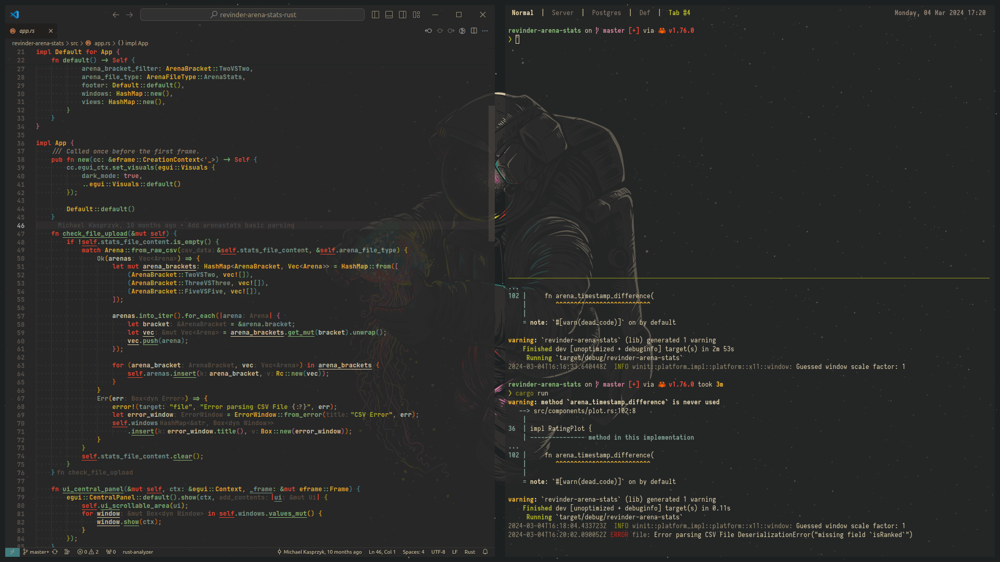

<h1 align="center">🚀 Revinder .dotfiles</h1> 

     

## 📋 Installation
1. Install all development tools from [Tools](#tools)
2. Install [Stow](https://www.gnu.org/software/stow/) and initialize in root directory: (`$ stow .`) 
3. Upgrade paths and email in `.gitconfig`

## 🛠️ Tools

In all honesty, this is meant for personal use only and I rarely change systems, which is why you have to install few tools manaully. For me, this hasn't been an issue before.

* `tools.sh` - contains list of specific tools that I use on a daily basis
* `gnome.sh` - contains gnome specific tools. There are some dconf configs for `openbar` and `roundedcorners` extensions that need to be loaded. See .config
