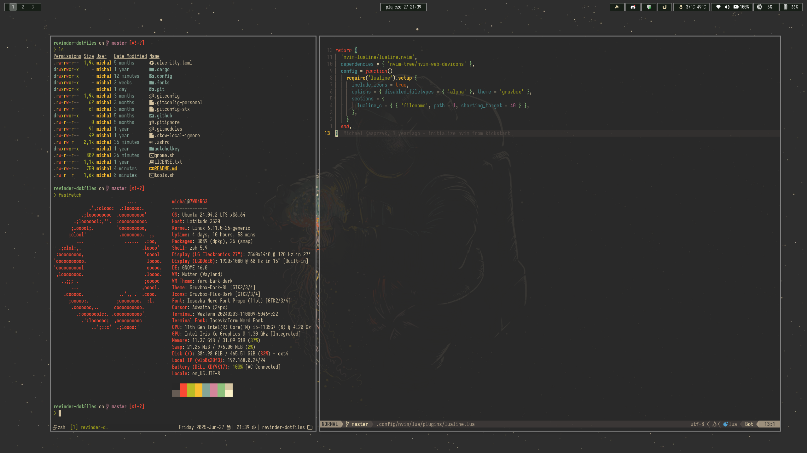

<h1 align="center">🚀 Revinder .dotfiles</h1> 
<p align="center">
     
</p>

## 📋 Installation
1. Install all development tools from [Tools](#tools)
2. Used fonts: [Iosevka Nerd Font](https://typeof.net/Iosevka/) and [JetbrainsMono Nerd Font](https://www.jetbrains.com/lp/mono/):
3. Install [Stow](https://www.gnu.org/software/stow/) and initialize in root directory: (`$ stow .`) 
4. Upgrade paths and email in `.gitconfig`

## 🛠️ Tools

In all honesty, this is meant for personal and I rarely change systems, which is why you have to install few tools manaully. For me, this hasn't been an issue before.

#### 🐍 Python
1. Install [PyEnv](https://github.com/pyenv/pyenv?tab=readme-ov-file#installation) for python version management. 
    
    `$ curl https://pyenv.run | bash`
2. Install [pipx](https://github.com/pypa/pipx?tab=readme-ov-file#on-linux) for isolation of dependencies using given python version or through apt.

    ```
    $ python -m pip install --user pipx
    $ python -m pipx ensurepath
    $ sudo pipx ensurepath --global # optional
    ```
3. All python dependencies should be installed using it now:
    * [Poetry](https://python-poetry.org/docs/#installation)

        `$ pipx install poetry`


#### 🦀 Rust 
1. Install [Rust](https://www.rust-lang.org/tools/install): 

    `$ curl --proto '=https' --tlsv1.2 -sSf https://sh.rustup.rs | sh`

2. Go to `.cargo` and run `$ python install.py` - this will install all cargo related tools - be wary, this will take quite a long time.

#### ✨ Others
1. Install [ lazygit ](https://github.com/jesseduffield/lazygit?tab=readme-ov-file#installation)

```
$ LAZYGIT_VERSION=$(curl -s "https://api.github.com/repos/jesseduffield/lazygit/releases/latest" | grep -Po '"tag_name": "v\K[^"]*')
$ curl -Lo lazygit.tar.gz "https://github.com/jesseduffield/lazygit/releases/latest/download/lazygit_${LAZYGIT_VERSION}_Linux_x86_64.tar.gz"
$ tar xf lazygit.tar.gz lazygit
$ sudo install lazygit /usr/local/bin
```

2. Install [ neovim ](https://github.com/neovim/neovim/blob/master/INSTALL.md#pre-built-archives-2) - any way you want but prefer building or at least prebuilt binaries:

```
$ curl -LO https://github.com/neovim/neovim/releases/latest/download/nvim-linux64.tar.gz
$ sudo rm -rf /opt/nvim
$ sudo tar -C /opt -xzf nvim-linux64.tar.gz
```

3. Shell related:
    * Install [ oh-my-zsh ](https://github.com/ohmyzsh/ohmyzsh)
    ```
    $ sh -c "$(curl -fsSL https://raw.githubusercontent.com/ohmyzsh/ohmyzsh/master/tools/install.sh)"
    ```

    * Install [ Starship ](https://starship.rs/)
    ```
    $ curl -sS https://starship.rs/install.sh | sh
    ```

4. Gnome shell extension:
    * [gTile](https://extensions.gnome.org/extension/28/gtile/)
    * [blurMyShell](https://extensions.gnome.org/extension/3193/blur-my-shell/)
    * [Rounded Window Corners](https://github.com/yilozt/rounded-window-corners)
